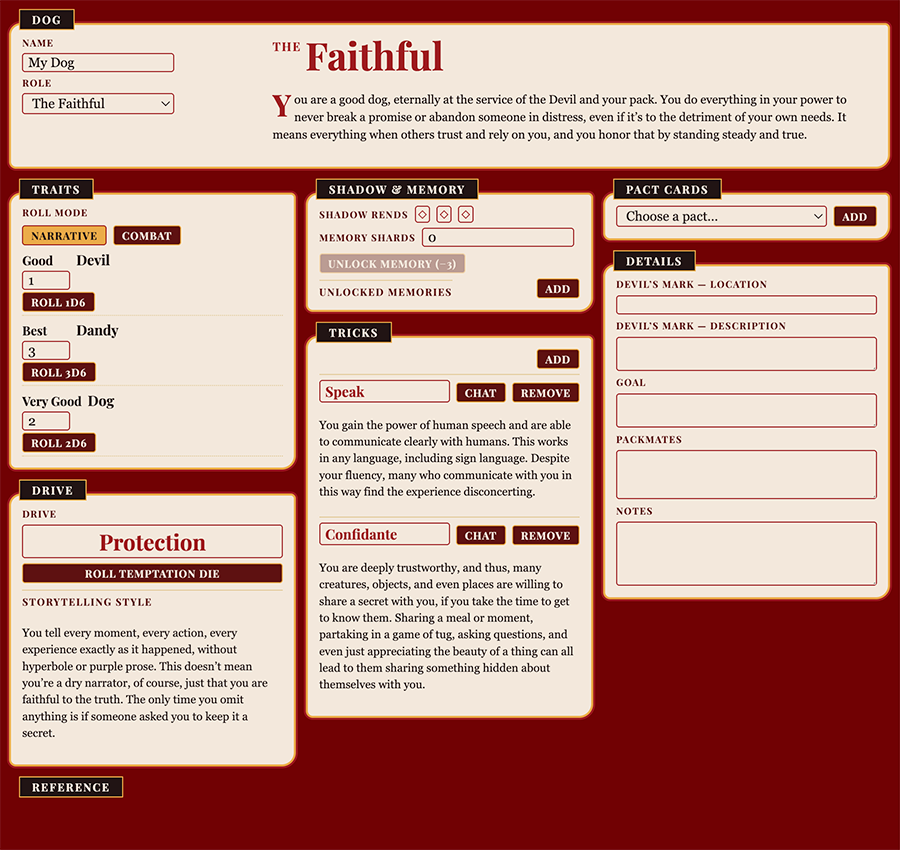

# The Devil's Dandy Dogs — official Roll20 Beacon character sheet

Official Beacon character sheet for **The Devil's Dandy Dogs**, published by
**Monte Cook Games**. Built with Vue 3, Pinia, and the Beacon SDK.



## Features

- The ten Roles, each with its Drive, storytelling style and Temptation die
- Traits with narrative and combat roll modes, rolled straight to chat
- Tricks, and Pact of the Pack cards picked from the bundled deck and posted to chat
- Shadow Rends and Memory Shards tracks, with the Shadow Riven state and
  memories unlocked by spending shards
- A Call & Response exchange tracker that freezes the rolled pool and its mode
- A folding reference panel for the dice tables and roll outcomes
- Themed chat roll cards rendered from `public/host.css`

## Development

```bash
npm i
npm run dev      # dev server with an offline relay (browser, no Roll20)
npm run build    # compiles scss, bundles dist/
```

## Structure notes

- `public/host.css` is compiled from `src/rollTemplates/host.scss` by
  `npm run build-scss`, which `npm run build` runs first. The chat-card styles
  live in `src/rollTemplates/common.scss`; edit the scss, not the compiled css.
- `src/data/*.json` are generated data files — the Role list and the Pact cards.
  They are bundled, not fetched.
- Colours, spacing and type all resolve to `--ddd-*` custom properties defined
  in `src/assets/main.css`; Tailwind aliases them via `@theme inline`, so no
  component rule carries a raw literal.
- The display face is Playfair Display (SIL Open Font License), inlined as a
  data URI so it resolves regardless of the deployed base path.
