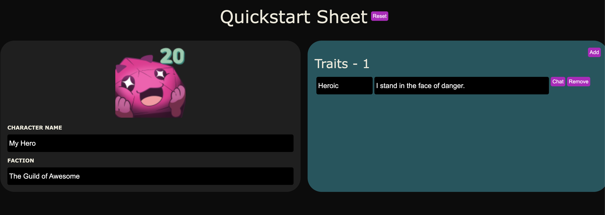

# Quickstart Beacon Example Sheet

This is the quickstart sheet example. This example sheet is setup with: 
* Vue.js framework
* Vite
* SCSS

Comments have been added to the files in this project to better explain their intent and suggested implementation.



## Getting Started

### Accessing the Beacon SDK

Add `@roll20/beacon-sdk` to your `package.json`.

```sh
npm i @roll20/beacon-sdk
```

### Install Dependencies

Before doing anything else you have to install the packages this project depends on.

```sh
npm install
```

Now that you have the project's dependencies installed you can run the vite server, to start testing changes to the project. To do so there are two ways you can boot up the server:

### Offline development
```sh
npm run dev
```

This will run the vite server, with the default port and environment set to development. What this means is that the project will read a mock Relay that allows you to open your project in any web browser by going to `http://localhost:5173`.

This is useful when you do not have access to the Roll20 website or would like to work on parts of your project that do not depend on a connect to the VTT or Roll20 Characters. Such as when working on stying, mocking up environment, building Vue components, testing functionality, etc..

While in development mode, you will not be able to save or access existing character data, or use the Beacon SDK functions that depend on VTT or Roll20 Characters functionality such as dice rolling and token manipulation.

### Sandbox development
```sh
npm run sandbox
```

This command will firstly build the SCSS files and then run the vite server with the port set to 7620 and environment set to staging mode. This sets the server up for connecting to a VTT custom sheet sandbox as well as through the sandbox in Roll20 Characters.

In order to test your changes in the VTT custom sheet sandbox, you will need to add the follwoing to the sheet.json editor in the games settings:
```
{
  "advanced": true,
  "advancedPort": 7620
}
```


## Below is a list of other available commands for this project
### Hot reload and build css for roll templates
```sh
npm run watch-scss
```

### Eslint Files
```sh
npm run lint
```

### Format with prettier
```sh
npm run format
```

## Deploying your sheet

Details for this coming soon!
